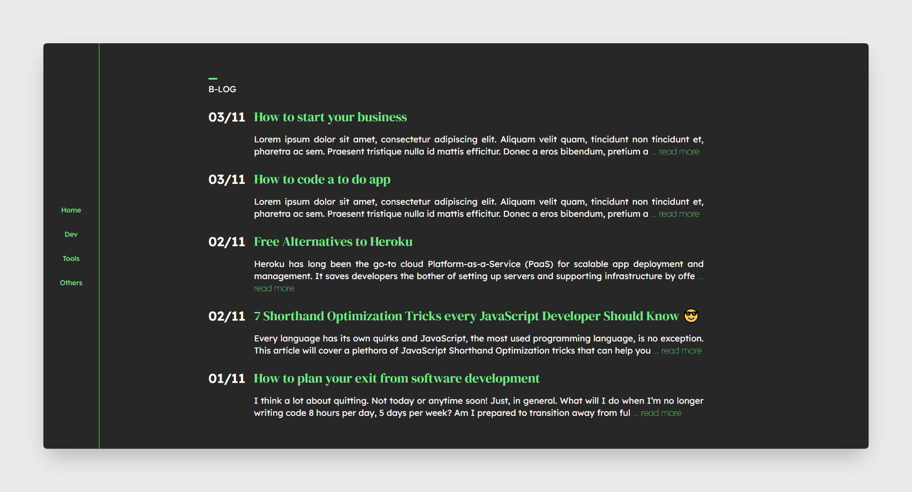
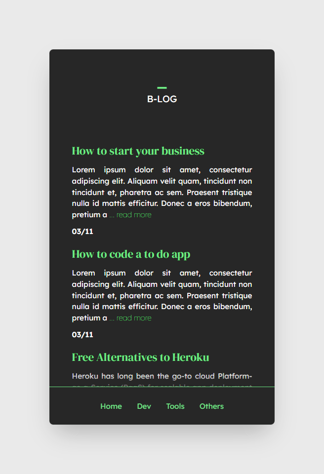

# React Blog

For this project, I decided to use React and Tailwind for the Frontend and Strapi with GraphQL for the Backend. 

The goal of this project is to develop a small blog with a home page, a category page and the article pages.

## Screenshots

## Tools

- React
- JavaScript
- Tailwind 
- Strapi

## Links

- [Strapi](https://strapi.io/)
- [GraphQL](https://graphql.org/)
- [Figma by Somnath Das](https://www.figma.com/community/file/1118764549305878223)