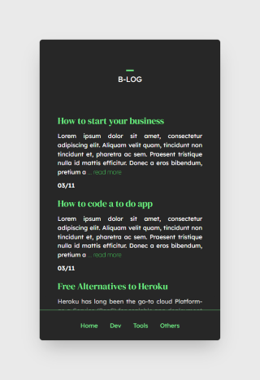

# React Blog

For this project, I decided to use React and Tailwind for the Frontend and Strapi with GraphQL for the Backend. 

The goal of this project is to develop a small blog with a home page, a category page and the article pages.

## Screenshots

 

## Run servers
```
cd backend/
npm run develop
```

```
cd frontend/
npm start
```